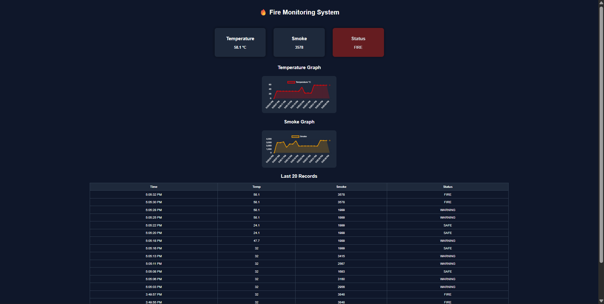

# 🔥 IoT Fire Monitoring System

A real-time **IoT Fire Detection and Monitoring System** built using **ESP32, MQTT, Node.js and MongoDB**.  
The system monitors temperature and smoke levels and sends alerts when fire conditions are detected.

---

# 🌐 Live Dashboard

View the live monitoring dashboard here:

https://iot-fire-monitoring-system.onrender.com/

---

# 🔌 ESP32 Simulation

Run the hardware simulation online using Wokwi:

https://wokwi.com/projects/457199387778954241

---

# 🖥 Dashboard Preview

Below is the web dashboard used to monitor fire conditions in real time.



---

# 📡 System Architecture

```
ESP32 Sensors
      ↓
MQTT Broker (HiveMQ Cloud)
      ↓
Node.js Backend (Render Cloud)
      ↓
MongoDB Atlas
      ↓
Live Web Dashboard
```

---

# 🚀 Features

- Real-time temperature monitoring  
- Smoke detection  
- Fire status detection (SAFE / WARNING / FIRE)  
- Automatic email alert when fire detected  
- Live dashboard with charts  
- Historical data storage in database  
- Cloud deployment using Render  

---

# 🧰 Technologies Used

## Frontend
- HTML
- CSS
- Chart.js

## Backend
- Node.js
- Express.js

## Database
- MongoDB Atlas

## IoT Communication
- MQTT (HiveMQ Cloud)

## Hardware
- ESP32
- DHT22 Temperature Sensor
- Smoke Sensor

---

# ⚙️ Run Locally

Clone the repository

```
git clone https://github.com/mhdkaifkhan/iot-fire-monitoring-system.git
```

Go into the project directory

```
cd iot-fire-monitoring-system
```

Install dependencies

```
npm install
```

Create `.env` file

```
MONGO_URI=
MQTT_HOST=
MQTT_USER=
MQTT_PASS=
ADMIN_EMAIL=
EMAIL_PASS=
```

Run the server

```
node index.js
```

Open the dashboard

```
http://localhost:5000
```

---

# 👨‍💻 Author

Mohammad Kaif

GitHub:  
https://github.com/mhdkaifkhan
